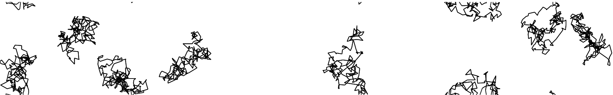

# Quantum Coulomb gases
This package provides Python scripts for simulation and visualization related to Maxwell-Boltzmann statistics for Coulomb gases

<p align="center">
</a>
</p>

[Coulomb systems](https://arxiv.org/abs/1712.04095) are interacting particle systems  with potential energy


where $g$ denotes the [Green's function](https://en.wikipedia.org/wiki/Green%27s_function) in the considered domain.

The [Feynman-Kac formalism](https://arxiv.org/pdf/math-ph/0605002.pdf) makes it possible to express the quantum-mechanical statistics -- i.e., [Maxwell-Boltzmann, Bose-Einstein and Fermi-Dirac](http://ajm.asj-oa.am/578/4/AJMThesis8.pdf) -- in terms of expectation with respect to Brownian bridges subject to an interaction governed by a time-integration of the potential energy above. 

This package provides an MCMC sampler for the Maxwell-Boltzmann statistics, where the bridges start and end at the same point. The domain is assumed to be torus elongated in one direction.

## TikZ output
The script [example.py](./example.py) generates a [TikZ](http://www.texample.net/tikz/) output of a realization taken from the MCMC sampler. To save realizations of 10 bridges into the file 'coulomb.tex' use the command

```sh
python3 example.py 10 coulomb.tex
```
